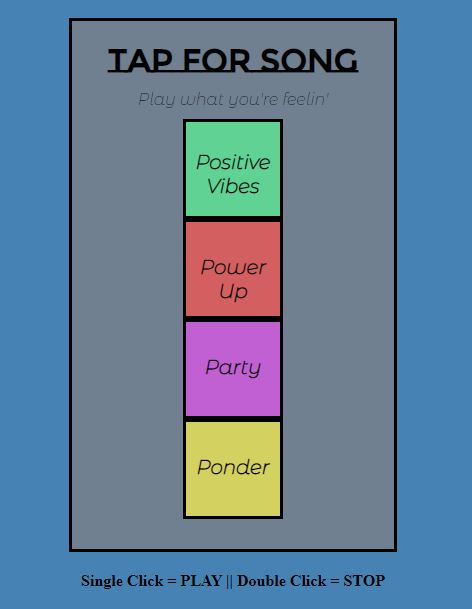

# Simple HTML & Javascript Soundboard App 

A simple application that allows users to click on pads to play songs. Single-click and the song plays, double-click and the song stops. 

## Technologies Used
* HTML/CSS
* Javascript

## Deployed Application
*[Soundboard App](https://soundboardapp-c9df9.web.app/)*

### Future Development
* Connect Spotify API to generate different musical choices
* Expand overall application to 2 or more categories

#### Developed by: Brandon Cermak